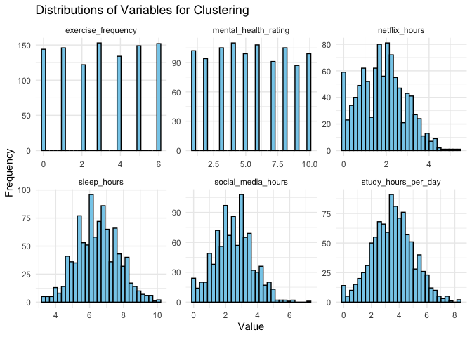
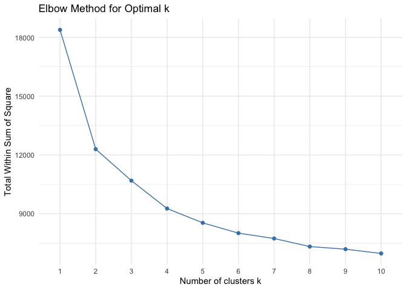
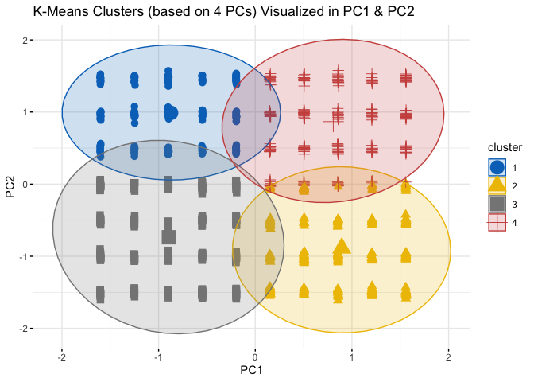

Clustering Students Habits
================
Shervairus_Morris
2025-05-14

## Introduction

This document explores potential clusters of students based on their
study habits, lifestyle factors, and mental health using the “Student
Habits vs Academic Performance” dataset.

## Loading Libraries and Data

First, we load the necessary libraries and the dataset.

``` r
library(tidyverse)
```

    ## ── Attaching core tidyverse packages ──────────────────────── tidyverse 2.0.0 ──
    ## ✔ dplyr     1.1.4     ✔ readr     2.1.5
    ## ✔ forcats   1.0.0     ✔ stringr   1.5.1
    ## ✔ ggplot2   3.5.1     ✔ tibble    3.2.1
    ## ✔ lubridate 1.9.3     ✔ tidyr     1.3.1
    ## ✔ purrr     1.0.2     
    ## ── Conflicts ────────────────────────────────────────── tidyverse_conflicts() ──
    ## ✖ dplyr::filter() masks stats::filter()
    ## ✖ dplyr::lag()    masks stats::lag()
    ## ℹ Use the conflicted package (<http://conflicted.r-lib.org/>) to force all conflicts to become errors

``` r
screen_time <- read_csv("data/student_habits_performance.csv")
```

    ## Rows: 1000 Columns: 16
    ## ── Column specification ────────────────────────────────────────────────────────
    ## Delimiter: ","
    ## chr (7): student_id, gender, part_time_job, diet_quality, parental_education...
    ## dbl (9): age, study_hours_per_day, social_media_hours, netflix_hours, attend...
    ## 
    ## ℹ Use `spec()` to retrieve the full column specification for this data.
    ## ℹ Specify the column types or set `show_col_types = FALSE` to quiet this message.

``` r
head(screen_time)
```

    ## # A tibble: 6 × 16
    ##   student_id   age gender study_hours_per_day social_media_hours netflix_hours
    ##   <chr>      <dbl> <chr>                <dbl>              <dbl>         <dbl>
    ## 1 S1000         23 Female                 0                  1.2           1.1
    ## 2 S1001         20 Female                 6.9                2.8           2.3
    ## 3 S1002         21 Male                   1.4                3.1           1.3
    ## 4 S1003         23 Female                 1                  3.9           1  
    ## 5 S1004         19 Female                 5                  4.4           0.5
    ## 6 S1005         24 Male                   7.2                1.3           0  
    ## # ℹ 10 more variables: part_time_job <chr>, attendance_percentage <dbl>,
    ## #   sleep_hours <dbl>, diet_quality <chr>, exercise_frequency <dbl>,
    ## #   parental_education_level <chr>, internet_quality <chr>,
    ## #   mental_health_rating <dbl>, extracurricular_participation <chr>,
    ## #   exam_score <dbl>

## Data Structure

Let’s examine the structure of the dataset using the `str()` function to
understand the data types of each column.

``` r
str(screen_time)
```

    ## spc_tbl_ [1,000 × 16] (S3: spec_tbl_df/tbl_df/tbl/data.frame)
    ##  $ student_id                   : chr [1:1000] "S1000" "S1001" "S1002" "S1003" ...
    ##  $ age                          : num [1:1000] 23 20 21 23 19 24 21 21 23 18 ...
    ##  $ gender                       : chr [1:1000] "Female" "Female" "Male" "Female" ...
    ##  $ study_hours_per_day          : num [1:1000] 0 6.9 1.4 1 5 7.2 5.6 4.3 4.4 4.8 ...
    ##  $ social_media_hours           : num [1:1000] 1.2 2.8 3.1 3.9 4.4 1.3 1.5 1 2.2 3.1 ...
    ##  $ netflix_hours                : num [1:1000] 1.1 2.3 1.3 1 0.5 0 1.4 2 1.7 1.3 ...
    ##  $ part_time_job                : chr [1:1000] "No" "No" "No" "No" ...
    ##  $ attendance_percentage        : num [1:1000] 85 97.3 94.8 71 90.9 82.9 85.8 77.7 100 95.4 ...
    ##  $ sleep_hours                  : num [1:1000] 8 4.6 8 9.2 4.9 7.4 6.5 4.6 7.1 7.5 ...
    ##  $ diet_quality                 : chr [1:1000] "Fair" "Good" "Poor" "Poor" ...
    ##  $ exercise_frequency           : num [1:1000] 6 6 1 4 3 1 2 0 3 5 ...
    ##  $ parental_education_level     : chr [1:1000] "Master" "High School" "High School" "Master" ...
    ##  $ internet_quality             : chr [1:1000] "Average" "Average" "Poor" "Good" ...
    ##  $ mental_health_rating         : num [1:1000] 8 8 1 1 1 4 4 8 1 10 ...
    ##  $ extracurricular_participation: chr [1:1000] "Yes" "No" "No" "Yes" ...
    ##  $ exam_score                   : num [1:1000] 56.2 100 34.3 26.8 66.4 100 89.8 72.6 78.9 100 ...
    ##  - attr(*, "spec")=
    ##   .. cols(
    ##   ..   student_id = col_character(),
    ##   ..   age = col_double(),
    ##   ..   gender = col_character(),
    ##   ..   study_hours_per_day = col_double(),
    ##   ..   social_media_hours = col_double(),
    ##   ..   netflix_hours = col_double(),
    ##   ..   part_time_job = col_character(),
    ##   ..   attendance_percentage = col_double(),
    ##   ..   sleep_hours = col_double(),
    ##   ..   diet_quality = col_character(),
    ##   ..   exercise_frequency = col_double(),
    ##   ..   parental_education_level = col_character(),
    ##   ..   internet_quality = col_character(),
    ##   ..   mental_health_rating = col_double(),
    ##   ..   extracurricular_participation = col_character(),
    ##   ..   exam_score = col_double()
    ##   .. )
    ##  - attr(*, "problems")=<externalptr>

## Summary Statistics

We’ll also use the `summary()` function to get descriptive statistics
for the numeric variables and frequency counts for the categorical ones.

``` r
summary(screen_time)
```

    ##   student_id             age           gender          study_hours_per_day
    ##  Length:1000        Min.   :17.00   Length:1000        Min.   :0.00       
    ##  Class :character   1st Qu.:18.75   Class :character   1st Qu.:2.60       
    ##  Mode  :character   Median :20.00   Mode  :character   Median :3.50       
    ##                     Mean   :20.50                      Mean   :3.55       
    ##                     3rd Qu.:23.00                      3rd Qu.:4.50       
    ##                     Max.   :24.00                      Max.   :8.30       
    ##  social_media_hours netflix_hours   part_time_job      attendance_percentage
    ##  Min.   :0.000      Min.   :0.000   Length:1000        Min.   : 56.00       
    ##  1st Qu.:1.700      1st Qu.:1.000   Class :character   1st Qu.: 78.00       
    ##  Median :2.500      Median :1.800   Mode  :character   Median : 84.40       
    ##  Mean   :2.506      Mean   :1.820                      Mean   : 84.13       
    ##  3rd Qu.:3.300      3rd Qu.:2.525                      3rd Qu.: 91.03       
    ##  Max.   :7.200      Max.   :5.400                      Max.   :100.00       
    ##   sleep_hours    diet_quality       exercise_frequency parental_education_level
    ##  Min.   : 3.20   Length:1000        Min.   :0.000      Length:1000             
    ##  1st Qu.: 5.60   Class :character   1st Qu.:1.000      Class :character        
    ##  Median : 6.50   Mode  :character   Median :3.000      Mode  :character        
    ##  Mean   : 6.47                      Mean   :3.042                              
    ##  3rd Qu.: 7.30                      3rd Qu.:5.000                              
    ##  Max.   :10.00                      Max.   :6.000                              
    ##  internet_quality   mental_health_rating extracurricular_participation
    ##  Length:1000        Min.   : 1.000       Length:1000                  
    ##  Class :character   1st Qu.: 3.000       Class :character             
    ##  Mode  :character   Median : 5.000       Mode  :character             
    ##                     Mean   : 5.438                                    
    ##                     3rd Qu.: 8.000                                    
    ##                     Max.   :10.000                                    
    ##    exam_score    
    ##  Min.   : 18.40  
    ##  1st Qu.: 58.48  
    ##  Median : 70.50  
    ##  Mean   : 69.60  
    ##  3rd Qu.: 81.33  
    ##  Max.   :100.00

## Check for Missing Data

Next I will check the data set for any missing values. I will use the
‘colSum()’ function.

``` r
colSums(is.na(screen_time))
```

    ##                    student_id                           age 
    ##                             0                             0 
    ##                        gender           study_hours_per_day 
    ##                             0                             0 
    ##            social_media_hours                 netflix_hours 
    ##                             0                             0 
    ##                 part_time_job         attendance_percentage 
    ##                             0                             0 
    ##                   sleep_hours                  diet_quality 
    ##                             0                             0 
    ##            exercise_frequency      parental_education_level 
    ##                             0                             0 
    ##              internet_quality          mental_health_rating 
    ##                             0                             0 
    ## extracurricular_participation                    exam_score 
    ##                             0                             0

## Notes on Initial Data Exploration

The dataset includes 1000 student records with 16 variables. We
identified nine numeric variables (`age`, `study_hours_per_day`,
`social_media_hours`, `netflix_hours`, `attendance_percentage`,
`sleep_hours`, `exercise_frequency`, `mental_health_rating`,
`exam_score`) and seven categorical variables (`student_id`, `gender`,
`part_time_job`, `diet_quality`, `parental_education_level`,
`internet_quality`, `extracurricular_participation`). The data types
appear appropriate.

The summary statistics for the numeric variables reveal the following
ranges and central tendencies:

- **Age:** Ranges from 17 to 24 (mean: 20.50, median: 20.00).
- **Study Hours:** Ranges from 0.0 to 8.3 (mean: 3.55, median: 3.50).
- **Social Media Hours:** Ranges from 0.0 to 7.2 (mean: 2.51, median:
  2.50).
- **Netflix Hours:** Ranges from 0.0 to 5.4 (mean: 1.82, median: 1.80).
- **Attendance:** Ranges from 56.0 to 100.0 (mean: 84.13, median:
  84.40).
- **Sleep Hours:** Ranges from 3.2 to 10.0 (mean: 6.47, median: 6.50).
- **Exercise Frequency:** Ranges from 0.0 to 6.0 (mean: 3.04, median:
  3.00).
- **Mental Health Rating:** Ranges from 1.0 to 10.0 (mean: 5.44, median:
  5.00).
- **Exam Score:** Ranges from 18.4 to 100.0 (mean: 69.60, median:
  70.50).

The `diet_quality` variable includes categories: Fair (326), Good (345),
Poor (329). The other categorical variables will require further
exploration to understand their distributions fully.

## Isolate Numeric Variables for clustering

I will create a new data frame that will contain the numerical
variables. I plan on using Principle Competent Analysis for this data
set. I will go into further detail in a later step.

``` r
numerical_data<-screen_time %>%
  select(study_hours_per_day, social_media_hours, netflix_hours,
         sleep_hours, exercise_frequency, mental_health_rating)

print(numerical_data)
```

    ## # A tibble: 1,000 × 6
    ##    study_hours_per_day social_media_hours netflix_hours sleep_hours
    ##                  <dbl>              <dbl>         <dbl>       <dbl>
    ##  1                 0                  1.2           1.1         8  
    ##  2                 6.9                2.8           2.3         4.6
    ##  3                 1.4                3.1           1.3         8  
    ##  4                 1                  3.9           1           9.2
    ##  5                 5                  4.4           0.5         4.9
    ##  6                 7.2                1.3           0           7.4
    ##  7                 5.6                1.5           1.4         6.5
    ##  8                 4.3                1             2           4.6
    ##  9                 4.4                2.2           1.7         7.1
    ## 10                 4.8                3.1           1.3         7.5
    ## # ℹ 990 more rows
    ## # ℹ 2 more variables: exercise_frequency <dbl>, mental_health_rating <dbl>

# Scale Numerical Data

``` r
scaled_data<-scale(numerical_data)
scaled_data<-as.data.frame(numerical_data)
head(numerical_data)
```

    ## # A tibble: 6 × 6
    ##   study_hours_per_day social_media_hours netflix_hours sleep_hours
    ##                 <dbl>              <dbl>         <dbl>       <dbl>
    ## 1                 0                  1.2           1.1         8  
    ## 2                 6.9                2.8           2.3         4.6
    ## 3                 1.4                3.1           1.3         8  
    ## 4                 1                  3.9           1           9.2
    ## 5                 5                  4.4           0.5         4.9
    ## 6                 7.2                1.3           0           7.4
    ## # ℹ 2 more variables: exercise_frequency <dbl>, mental_health_rating <dbl>

## Visualize Distrubtion of Data

``` r
library(ggplot2)
library(tidyr)

# Prepare the data for plotting distributions
distributions_data <- scaled_data %>%
  pivot_longer(cols = everything(), names_to = "Variable", values_to = "Value")

# Create the histograms
ggplot(distributions_data, aes(x = Value)) +
  geom_histogram(fill = "skyblue", color = "black") +
  facet_wrap(~ Variable, scales = "free") +
  labs(
    title = "Distributions of Variables for Clustering",
    x = "Value",
    y = "Frequency"
  ) +
  theme_minimal()
```

    ## `stat_bin()` using `bins = 30`. Pick better value with `binwidth`.

<!-- -->

## Checking for Multicollinearity

After examining the histograms of the numeric variables, we observed the
distributions of study hours, social media hours, and Netflix hours
appeared to be somewhat right-skewed, suggesting that some students
engage in these activities more than others. Additionally, variables
like sleep hours and mental health rating showed more central
tendencies. While the histograms provide insights into the individual
distributions, they don’t directly reveal the relationships *between*
these variables.

Given that K-Means clustering relies on distance metrics, and highly
correlated variables could disproportionately influence these distances,
I decided to check for multicollinearity among our numeric variables
before proceeding with the Elbow Method and the K-Means algorithm. High
multicollinearity could indicate redundancy in our features, where some
variables are essentially measuring the same underlying construct.
Addressing this could lead to more stable and interpretable clusters.

I will use the Variance Inflation Factor (VIF) to assess the degree of
multicollinearity.

``` r
library(car)
```

    ## Warning: package 'car' was built under R version 4.3.3

    ## Loading required package: carData

    ## 
    ## Attaching package: 'car'

    ## The following object is masked from 'package:dplyr':
    ## 
    ##     recode

    ## The following object is masked from 'package:purrr':
    ## 
    ##     some

``` r
# Calculate Variance Inflation Factors (VIF) for the original, unscaled numeric variables
vif_values <- vif(lm(study_hours_per_day ~ social_media_hours + netflix_hours +
                       sleep_hours + exercise_frequency + mental_health_rating,
                     data = screen_time))

# Print the VIF values
print(vif_values)
```

    ##   social_media_hours        netflix_hours          sleep_hours 
    ##             1.001885             1.000233             1.000796 
    ##   exercise_frequency mental_health_rating 
    ##             1.001850             1.000109

The Variance Inflation Factors for all six of our chosen numeric
variables are extremely low (very close to 1). This definitively
indicates that there is no significant multicollinearity among these
variables in the original dataset. Each variable’s variance is not
inflated by the presence of the others, meaning they are largely
independent of each other in terms of linear relationships.

\#Principle Competent Analysis (PCA)

``` r
# Perform PCA on the scaled data
pca_result <- prcomp(scaled_data, scale. = FALSE) # scale. = FALSE since data is already scaled

# Examine the explained variance
print(summary(pca_result))
```

    ## Importance of components:
    ##                           PC1    PC2    PC3     PC4     PC5    PC6
    ## Standard deviation     2.8475 2.0273 1.4700 1.22724 1.16840 1.0733
    ## Proportion of Variance 0.4406 0.2233 0.1174 0.08184 0.07418 0.0626
    ## Cumulative Proportion  0.4406 0.6640 0.7814 0.86321 0.93740 1.0000

The table of my components shows that the first 4 principle competent
make up 85% of the variance of my data.

\##Determining Cutoff for K-Means Clustering I will use the elbow method
to determining the optimal number of clusters. I will use the
‘fviz_nbclust()’ function along with the kmeans clustering method to
generate the elbow plot.

``` r
library(factoextra)
```

    ## Welcome! Want to learn more? See two factoextra-related books at https://goo.gl/ve3WBa

``` r
set.seed(1234) #for  reproducibility
fviz_nbclust(scaled_data, kmeans, method = "wss") +
  labs(title = "Elbow Method for Optimal k") +
  theme_minimal()
```

<!-- -->

the “elbow” appears to be around k=4. This suggests that using 4
clusters might be a good choice for our K-Means algorithm. Now i will
move to the clusting. For this project I will be using K-Means
clustering.

``` r
set.seed(123) 
# Create a data frame with the principal components
pca_df <- as.data.frame(pca_result$x[, 1:4])
# --- K-Means on First Four Principal Components ---
kmeans_pca_result <- kmeans(pca_df, centers = 4, nstart = 10) 

# Add cluster assignments back to a dataframe that includes the first two PCs for visualization
pca_df_clustered <- as.data.frame(pca_result$x[, 1:2]) %>%
  mutate(cluster = factor(kmeans_pca_result$cluster))

# --- Visualize Clusters in PCA Space (using the first two PCs for the plot) ---
fviz_cluster(kmeans_pca_result, data = as.data.frame(pca_result$x[, 1:2]),
             ellipse.type = "t",
             geom = "point",
             pointsize = 3,
             palette = "jco",
             ggtheme = theme_minimal(),
             main = "K-Means Clusters (based on 4 PCs) Visualized in PC1 & PC2")
```

<!-- -->

``` r
# Examine the cluster centroids in the PCA space (first four components)
print(kmeans_pca_result$centers)
```

    ##         PC1       PC2         PC3           PC4
    ## 1 -2.477206  2.002528 -0.22362066  0.0415381900
    ## 2  2.547268 -1.796256 -0.17561415  0.0007540685
    ## 3 -2.545408 -1.493046  0.09534323 -0.0231116011
    ## 4  2.297192  1.757303  0.23470397 -0.0077951625

``` r
# Examine the loadings of the principal components
print(pca_result$rotation)
```

    ##                                PC1           PC2          PC3          PC4
    ## study_hours_per_day   0.0026394521 -0.0446381039 -0.994559386  0.061867814
    ## social_media_hours   -0.0007273151 -0.0327461552 -0.035668386  0.216534838
    ## netflix_hours        -0.0035591468 -0.0041668292  0.048690257 -0.002579644
    ## sleep_hours           0.0034215174  0.0193358123  0.070788864  0.974261748
    ## exercise_frequency    0.0003630521  0.9982703896 -0.046809196 -0.009013304
    ## mental_health_rating -0.9999839990  0.0003494146 -0.002547275  0.003345224
    ##                               PC5          PC6
    ## study_hours_per_day   0.047823828 -0.052319743
    ## social_media_hours   -0.972320511  0.073214856
    ## netflix_hours        -0.077201038 -0.995807499
    ## sleep_hours           0.212539433 -0.015633074
    ## exercise_frequency   -0.034196082 -0.003792743
    ## mental_health_rating  0.001823003  0.003298066

# Key Insights

Cluster 1 (Blue Circles - Top Left): The “Healthy and Engaged” Students:
These students tend to have higher mental health ratings and higher
exercise frequency. They also potentially have higher study hours and
more sleep.

Cluster 2 (Yellow Triangles - Bottom Right): The “Potentially Stressed
and Less Active” Students: These students tend to have lower mental
health ratings and lower exercise frequency. They also potentially have
higher study hours and more sleep.

Cluster 3 (Gray Squares - Bottom Left): The “Potentially Less Active but
Positive” Students: These students tend to have higher mental health
ratings but lower exercise frequency. They also potentially have lower
study hours and less sleep.

Cluster 4 (Red Crosses - Top Right): The “Active but Potentially
Stressed” Students: These students tend to have lower mental health
ratings but higher exercise frequency. They also potentially have lower
study hours and less sleep.

# Summary of Findings

I started by exploring the distributions of the numeric variables. Then
scaled the data and used the Elbow Method to help us determine a
suitable number of clusters. I performed PCA to reduce dimensionality
and visualize the clusters, deciding to cluster on the first four
principal components which captured a significant amount of variance.
The resulting four clusters show distinct patterns in terms of mental
health, exercise frequency, and potentially study and sleep habits.
